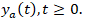
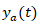
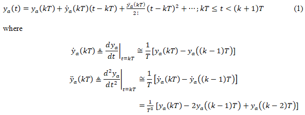
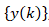
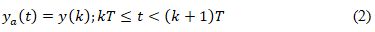
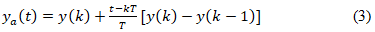

## Introduction

<b>Discipline | <b>Electrical Engineering 
:--|:--|
<b> Lab | <b> Digital Control Lab
<b> Experiment|     <b> Determine frequency response of zero order hold and first order hold using actual transfer functions and Pade approximations and Exp 1

### About the Experiment 

 **The Hold Operation**

In the computer-controlled systems, it is necessary to convert the control actions calculated by the computer as a sequence of numbers, to a continuous-time signal that can be applied to the process.

The problem of hold operation may be posed as follows:

Given a sequence , we have to construct  

A commonly used solution to the problem of hold operation is polynomial extrapolation. Using Taylor’s series expansion about , we can express  as 

If only the first term in expansion (1) is used, the data hold is called a zero-order hold (ZOH). 
Here we assume that the function   is approximately constant within the sampling interval, at a value equal to that of the function at the preceding sampling instant. 

Therefore, for a given input sequence , the output of ZOH is given by 

The first two terms in expansion (1) are used to realize the first-order hold. For a given input sequence , the output of the first-order hold is given by

It is obvious from expansion (1) that the higher the order of the derivative to be approximated, the larger will be the number of delay pulses required. The time-delay adversely affects the stability of feedback control systems. 

Furthermore, a high-order extrapolation requires complex circuitry and results in high costs of construction. The ZOH is the simplest, and most commonly used, data hold device. 
The standard D/A converters are often designed in such a way that the old value is held constant until a new conversion is ordered.

	

<b>Subject matter expertise | <b> **Prof. Alok Kanti Deb**
:--|:--|
<b> Institute | <b>  **Indian Institute of Technology Kharagpur**
<b> Email id|     <b>  **alokkanti@ee.iitkgp.ac.in**
<b> Department |  **Department of Electrical Engineering**
<b>Webpage| <b> http://www.iitkgp.ac.in/department/EE/faculty/ee-alokkanti

### Contributors List

SrNo | Name | VLabs Developer or Integration Engineer | Designation | Department| Institute
:--|:--|:--|:--|:--|:--|
1 | **Kamal Sandeep Karreddula** | Developer | Research Scholar | Department of Electrical Engineering | IIT Kharagpur | 
2 | **Piyali Chattopadhyay** | Integration Engineer | Project Scientist | Department of Mechanical Engineering | IIT Kharagpur |

