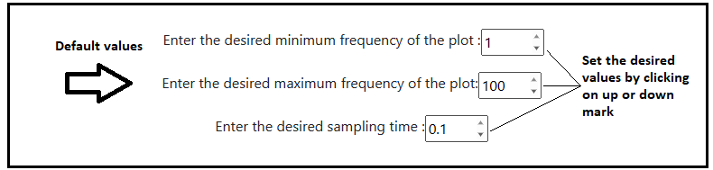
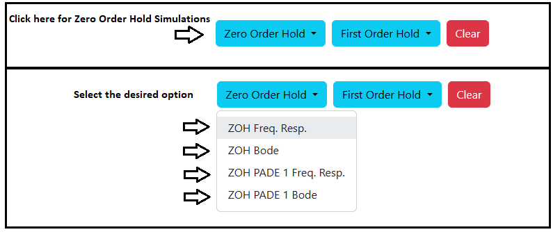
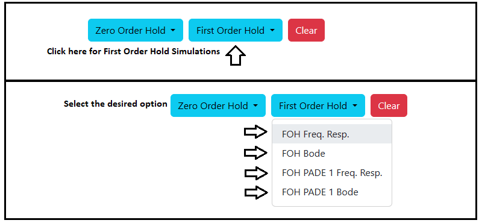

### Procedure

<b>Steps to perform the simulation</b>

										
1. At first enter the desired values of minimum frequency, maximum frequency and sampling time. Here default values are 1 for minimum frequency,
100 for maximum frequency and 0.1 for sampling frequency.

<figcaption style="color:black"> Fig.1. Maximum, Minimum Frequency and Sampling time values entry </figcaption>						  

2. Click on 'Zero Order Hold' dropdown-menu and click on the desired option to start simulation.
Click on 'OK' button beside the 'Download' button. Plot can be downloaded by clicking on 'Download' button.

<figcaption style="color:black"> Fig.2. Selecting simulation options for ZOH </figcaption>							  

3. Click on 'First Order Hold' dropdown-menu and click on the desired option to start simulation.
Click on 'OK' button beside the 'Download' button. Plot can be downloaded by clicking on 'Download' button.

<figcaption style="color:black"> Fig.3. Selecting simulation options for FOH </figcaption>	

4. Click on 'Clear' button before the every simulation to clear the previous plot.

